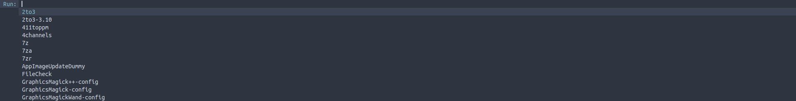

# dmenu-pixelfiles

My [Dmenu](https://tools.suckless.org/dmenu/) Build for [pixelfiles](https://github.com/mohannadk28/pixelfiles) :D

---

## Patches
1. [alpha](https://tools.suckless.org/dmenu/patches/alpha/)
2. [xresources](https://tools.suckless.org/dmenu/patches/xresources/)
